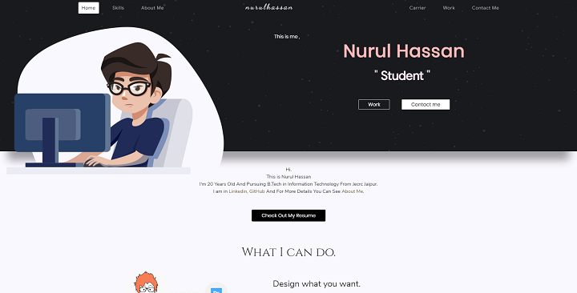

<h1 align="center">
  nurulhassan - v3
</h1>

  The Third iteration of <a href="https://nurulhassan.tech/" target="_blank">nurulhassan</a> built with Angular, SCSS, Typescript and Bootstrap.

## 🚨 Forking this repo (please read!)

Many people have contacted me asking me if they can use this code for their own website, and the answer to that question is usually **yes, with attribution**.

I value keeping my site open source, but as you all know, _**plagiarism is bad**_. It's always disheartening whenever I find that someone has copied my site without giving me credit. I spent a non-trivial amount of effort building and designing this iteration of my website, and I am proud of it! All I ask of you all is to not claim this effort as your own.

This project was generated with [Angular CLI](https://github.com/angular/angular-cli) version 9.1.8.

## Development server

Run `ng serve` for a dev server. Navigate to `http://localhost:4200/`. The app will automatically reload if you change any of the source files.

## Code scaffolding

Run `ng generate component component-name` to generate a new component. You can also use `ng generate directive|pipe|service|class|guard|interface|enum|module`.

## Build

Run `ng build` to build the project. The build artifacts will be stored in the `dist/` directory. Use the `--prod` flag for a production build.

## Running unit tests

Run `ng test` to execute the unit tests via [Karma](https://karma-runner.github.io).

## Running end-to-end tests

Run `ng e2e` to execute the end-to-end tests via [Protractor](http://www.protractortest.org/).

## Further help

To get more help on the Angular CLI use `ng help` or go check out the [Angular CLI README](https://github.com/angular/angular-cli/blob/master/README.md).
